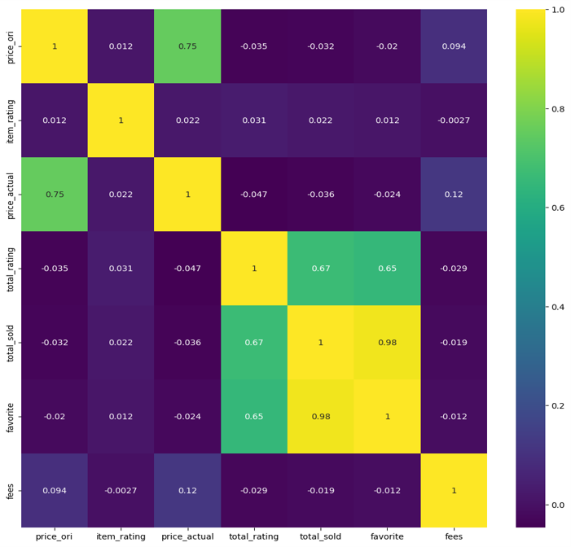
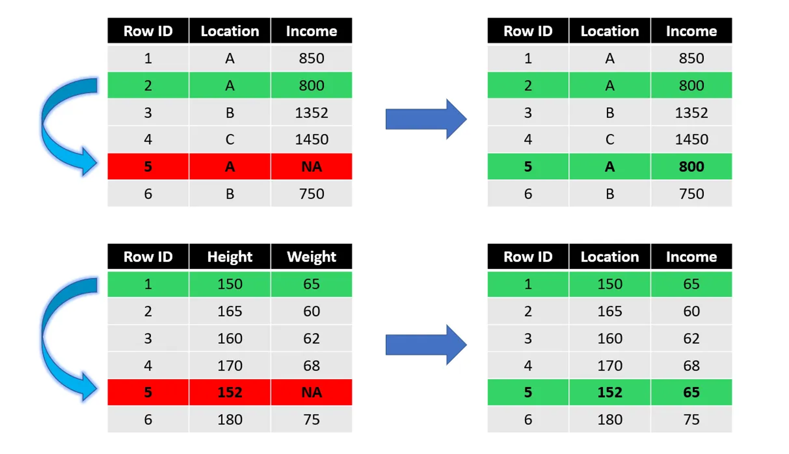
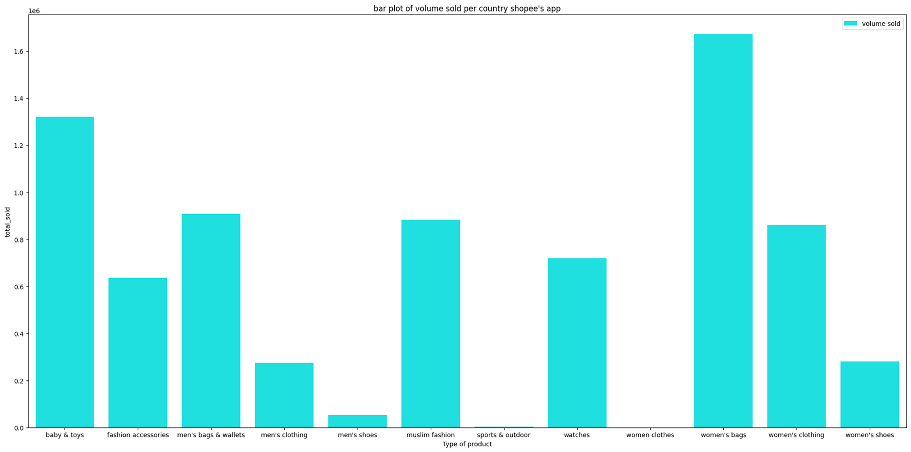
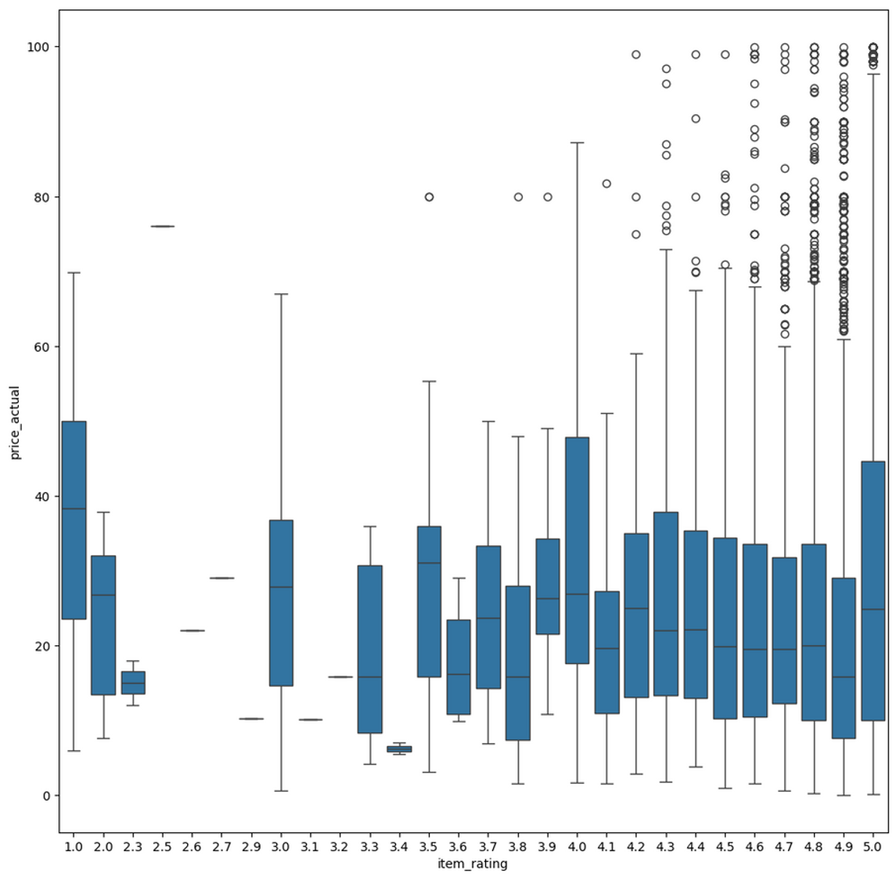
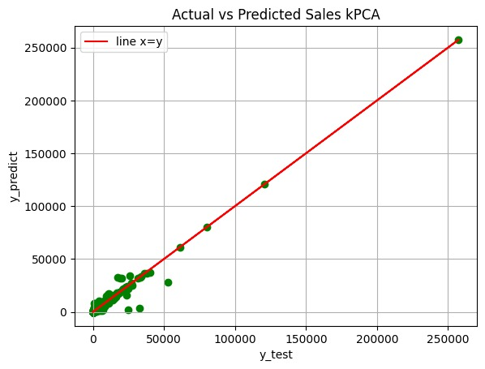
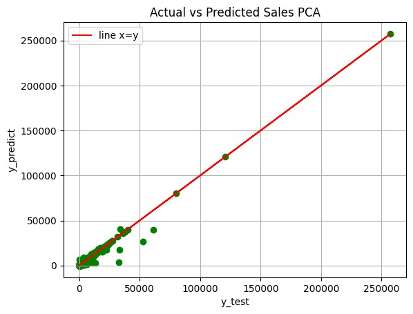
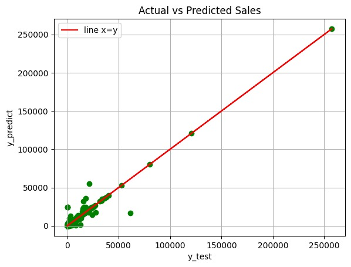
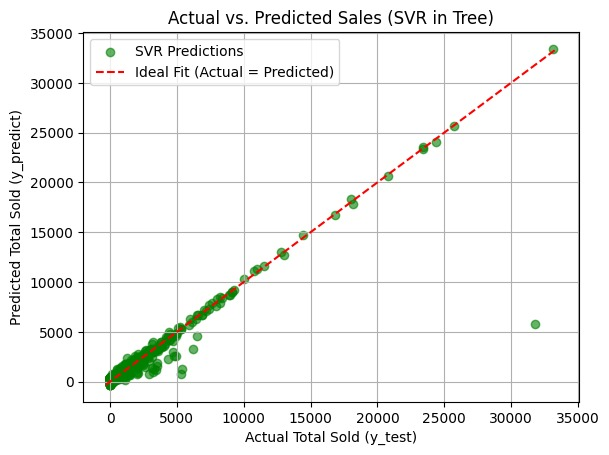

# WQD7001_Group2_Predicting Shopee Fashion Sales During Promotional Events Using SVR and XGBoost Enhanced with KPCA
# 🏍️ Predicting Shopee Fashion Sales Using SVR and XGBoost Enhanced with KPCA

---

## 📌 Project Overview

This project applies machine learning models — specifically SVR and XGBoost enhanced with Kernel PCA — to forecast Shopee fashion product sales during major promotional events (e.g., 11.11, 12.12).

---

## 🌟 Objectives

* Forecast product sales to assist Shopee sellers and strategists

* Identify key customer behavior factors (e.g., ratings, favorites, discounts)

* Compare models and select the best performer

---

## 📊 Dataset

* **Source**: [Shopee Sample Data on Kaggle](https://www.kaggle.com/datasets/abelwahabbahaa/shopee-sample-data)
* **Scope**: Malaysian fashion items, Nov–Dec 2020
* **Raw Size**: 42,425 rows × 22 features
* **Cleaned Size**: 14,370 rows × 12 features

**Key Features**:

* `price_ori`, `price_actual`, `item_rating`, `total_rating`, `total_sold`, `favorite`, `fees`, `discount`

---

## 🧹 Data Cleaning Highlights

* Hot-deck Imputation to fill missing values by similarity

* Extracted features such as `discount`, `delivery_fee`

* Dropped irrelevant columns and normalized formats




---

## 📊 Exploratory Data Analysis (EDA)

* Strongest correlation: `favorite` ↔ `total_sold` (\~0.98)

* Most sold categories: `women's bags`, `baby & toys`

* High-rated products span wide price ranges






---

## 🧠 Models

### Implemented:

* `tree_model_SVR.pkl` — Tree-structured Support Vector Regressor
* `TreeDecision_XGBOOST_model.pkl` — Standard XGBoost
* `TreeDecision_XGBOOST_PCA_model.pkl` — XGBoost + PCA
* `TreeDecision_XGBOOST_KPCA_model.pkl` — ✅ **XGBoost + KPCA** (main focus)

---

## 🧪 Model Evaluation

Four models were tested and compared based on predicted vs actual values.

| Model              | Visual                           |
| ------------------ | -------------------------------- |
| KPCA + XGBoost     |   |
| PCA + XGBoost      |     |
| XGBoost (baseline) |  |
| SVR Tree           |            |

---

## 💻 How to Use

### Step 1. Run the GUI

```bash
cd code/
python data_product.py
```

* Choose model in dropdown

* Upload test CSV file (must include selected features)

* View prediction plot


### Step 2. Re-train Models

```bash
python create_save_models.py
```

Loads cleaned dataset, retrains all models, and saves `.pkl` to `models/`

---

## 📁 Directory Structure

```
WQD7001_Project/
├── code/                # All Python code and Notebooks
├── models/              # Trained model files (.pkl)
├── data/                # CSV data
├── docs/                # Reports and proposal documents
├── images/              # All visualizations
├── README.md            # This file
```

---

## 👨‍👩‍👧 Group Members

| Name          | Role      | Matric    |
| ------------- | --------- | --------- |
| Leonal Sigar  | Leader    | 24062655  |
| Lin Yuqi      | Secretary | 24077562  |
| Zhang Yushan  | Detective | 23076749  |
| Chadli Rayane | Oracle    | 24075296  |
| Zheng Wang    | Maker     | 24082308  |

---

## 📄 License

For academic use only.
